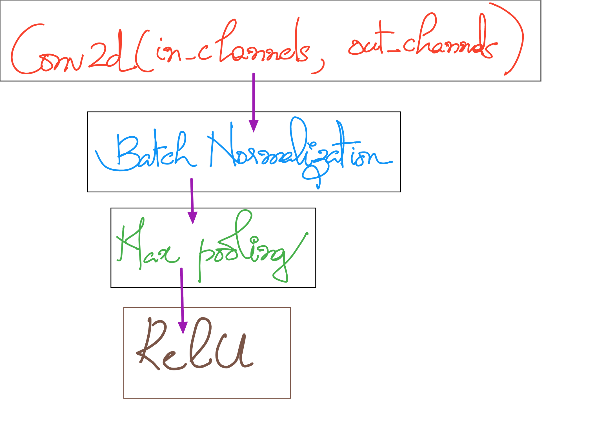

# EVA6-Phase1 Session 3 Submission

Submitted by: _Siva Sankar Anil Kumar_

# Problem statement

- The problem statement requires us to take in an MNIST hand written image and a normal digit as inputs to a neural network and predict the **MNIST digit label** and **the sum of the MNIST digit and the input digit**

### Inputs
  - _MNIST Image_
  - _A normal number_

### Outputs
  - _MNIST output label_
  - _Sum of MNIST number and input digit_


# Results

| _Metric_ | _Value_ |
| --- | --- |
| **MNIST Label Accuracy** | **99.87** |
| **MNIST Label + Sum Accuracy** | **87.82** |
| **Epochs** | **30** |
| **Optimizer** | **SGD** |
| **No of parameters** | **6670** |

## Network architecture

### The strategy

- **Convolutional part**
  - The convolutional part of the network consists of 3 identical blocks
  - Each block has the following structure
    
  - The complete network consists of 3 such blocks
  - The output of these layers would end up at **7 X 7**
  - Each layer has kernel size of **3 X 3** with padding **1**
 
- **Output GAP layer**
  - The GAP layer provides a head for the network that predicts the MNIST labels.

- **Sum input embedding**
  - Since the second input is a categorical between 0 and 9, it makes sense to encode the input using an embedding layer
  - Rather than assuming one-hot encoding to be the best encoding style for the problem, the experiment gives 
    an opportunity for the network to find an optimum representation for the input numbers.

- **GAP output embedding**
  - This approach uses the output of the GAP layer to select an index that wins as the same way we implement Binary Cross Entropy Loss
  - Once the winning node is calculated, an embedding for that winning node is computed
  - This embedding is summed with the input embedding to create the next head.
  
- **Output heads**
  - _Head 1_ :  The GAP layer head that predicts MNIST labels
  - _Head 2_ :  Sum of embeddings from winning GAP layer output and the input number which is used to predict the required sum 


### Network Architecture
  - Overall structure
  
  
  - Parameter count
```
----------------------------------------------------------------
        Layer (type)               Output Shape         Param #
================================================================
            Conv2d-1             [2, 8, 28, 28]              72
       BatchNorm2d-2             [2, 8, 28, 28]              16
         MaxPool2d-3             [2, 8, 14, 14]               0
       BatchNorm2d-4             [2, 8, 14, 14]              16
              ReLU-5             [2, 8, 14, 14]               0
            Conv2d-6            [2, 16, 14, 14]           1,152
       BatchNorm2d-7            [2, 16, 14, 14]              32
         MaxPool2d-8              [2, 16, 7, 7]               0
              ReLU-9              [2, 16, 7, 7]               0
           Conv2d-10              [2, 32, 7, 7]           4,608
      BatchNorm2d-11              [2, 32, 7, 7]              64
        MaxPool2d-12              [2, 32, 3, 3]               0
             ReLU-13              [2, 32, 3, 3]               0
AdaptiveAvgPool2d-14              [2, 32, 1, 1]               0
           Linear-15                    [2, 10]             330
        Embedding-16                    [2, 19]             190
        Embedding-17                    [2, 19]             190
================================================================
Total params: 6,670
Trainable params: 6,670
Non-trainable params: 0
----------------------------------------------------------------
Input size (MB): 0.01
Forward/backward pass size (MB): 0.44
Params size (MB): 0.03
Estimated Total Size (MB): 0.47
----------------------------------------------------------------
```
### Loss Function and Loss Plot

- Loss function
  The loss function for the problem statement is computed as the sum of cross-entropy losses for the MNIST label prediction and Sum prediction
  
  

- Loss plot


### Statistical metrics

- This plot shows the evolution of precision, recall and f1-score of the different MNIST classes on the test dataset while training
  

- This plot shows the evolution of precision, recall and f1-score of the different Sum label classes on the test dataset while training
  

# Inferences

- This experiment gives good results for adding an embedding layer on to te end of GAP layer from the convolutional layer based on the winning neuron
- Embeddings have been added to produce the final result and can be replaced with concatenation and downsampling as future work
- The neural network tends to have difficulty in classifying sum labels that can occur as a combination of different numbers
  - For example 0 as sum result can occur only with both inputs being 0. THis case is easily learnt by the network
  - Considering 13 which has a low score in statistical metrics can occur as a result of multiple combinations like 9 + 4, 10 + 3, 8 + 5 ans so on.
